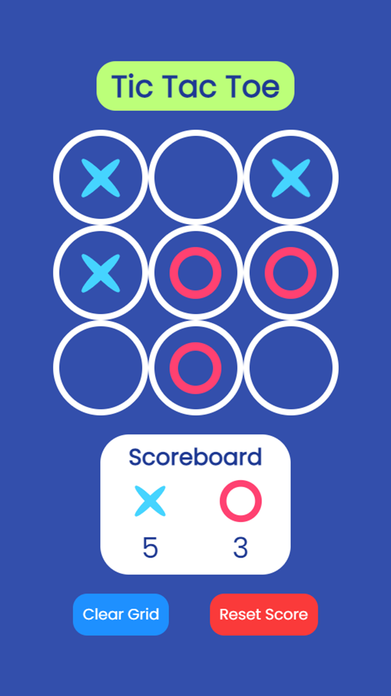
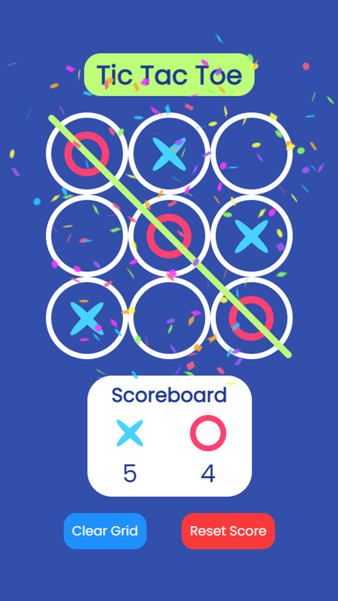
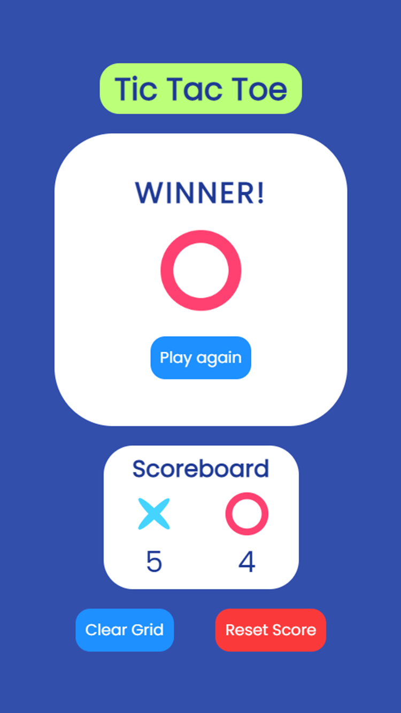

<h1 align="center">Tic Tac Toe</h1>

What if you don't have a pen and a piece of paper? Not a problem! Play the classic game of Tic Tac Toe right on your device!

<h3 align="center">Click <a href="https://sourhub226.github.io/tic-tac-toe-js/">here</a> to play now!</h3>
 

Progressive Web Game built using HTML, CSS and Javascript.

